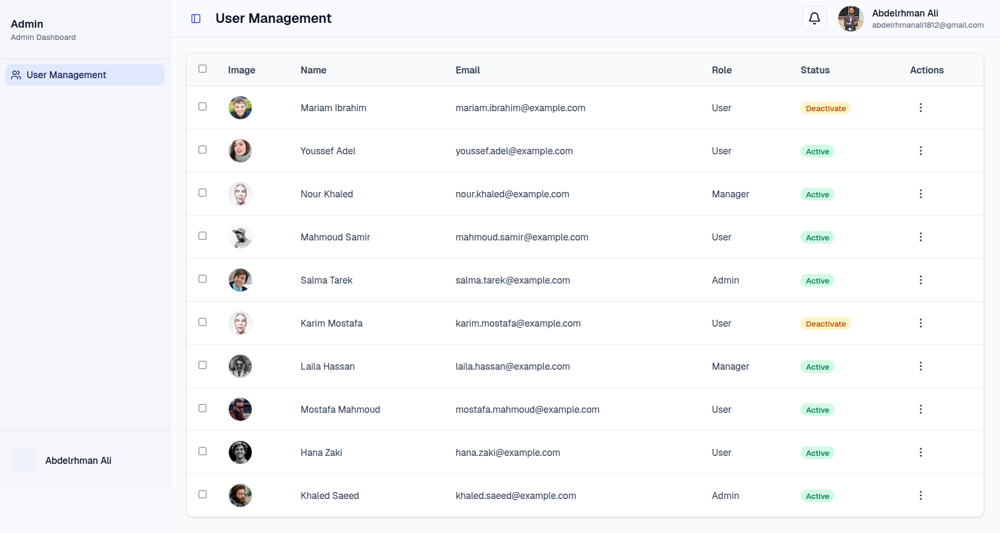

# User Management Dashboard

A technical assessment for building a modern **User Management Dashboard** using React, TypeScript .

The application demonstrates a reusable **Generic DataTable** component, REST API integration, clean architecture, and a responsive user interface.

---

## Features

### Dashboard Layout

- Responsive Sidebar
- Top Navigation Bar

### Generic DataTable

A reusable table component that supports:

- Dynamic columns
- Generic TypeScript support
- Custom cell rendering
- Row actions
- Row selection
- Loading state
- Empty state
- Reusable across different features

### User Management

- Display users in a structured table
- View user details
- Edit user information
- Toggle user status (Active / Inactive)
- Delete individual users

### API Integration

Using **JSON Server** as a mock REST API.

Implemented endpoints:

- Get all users
- Get user by ID
- Update user
- Delete user

### User Experience

- Loading Skeleton
- Empty State
- Error Handling
- Toast Notifications
- Responsive Layout

---

# 🛠 Tech Stack

- React
- TypeScript
- Tailwind CSS
- shadcn/ui
- TanStack React Query
- Axios
- React Hook Form
- Zod
- JSON Server
- React Toastify
- Lucide React

---

# 📁 Project Structure

```text
src
│
├── components
│   ├── shared
│   │   └── DataTable
│   └── ui
│
├── features
│   └── users
│       ├── api
│       ├── components
│       ├── hooks
│       ├── schemas
│       ├── types
│       └── utils
│
├── layouts
├── app
│   └── UserPage
├── providers
├── services
└── routes
```

---

# Design System

This project uses **shadcn/ui**.

### Why shadcn/ui?

- Fully customizable components
- Seamless Tailwind CSS integration
- Accessible UI components

---

# Data Fetching

Data fetching using **TanStack React Query**.

Features include:

- Server state management
- Background refetching
- Loading states
- Error handling

---

# Form Handling

Forms are built using:

- React Hook Form
- Zod validation

This provides:

- Type-safe forms
- Schema validation

---

# API Endpoints

| Method | Endpoint     | Description        |
| ------ | ------------ | ------------------ |
| GET    | `/users`     | Fetch all users    |
| GET    | `/users/:id` | Fetch user details |
| PATCH  | `/users/:id` | Update user        |
| DELETE | `/users/:id` | Delete user        |

---

# Screenshots



---

**Abdelrahman Ali**

---

Thank you for reviewing this project.
